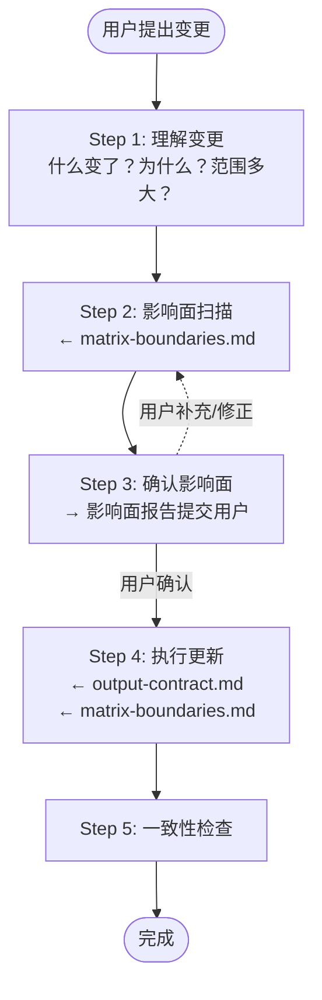

# 事实更新协议

> 本文档是"事实更新"场景的操作协议。用户提出特定变更，AI 定位归属并执行文档更新。

## 流程概览



---

## 前置条件

- 项目已有控制文档矩阵（AGENTS / INTENT / WORKFLOW / SPEC）
- 用户明确告知了变更内容（新功能、技术选型变化、结构调整等）

---

## Step 1：理解变更

| 动作 | 说明 |
|------|------|
| 1.1 | 确认变更的具体内容：改了什么？加了什么？删了什么？ |
| 1.2 | 确认变更的原因：为什么做这个变更？ |
| 1.3 | 确认变更的范围：是局部修改还是架构级调整？ |

若用户描述模糊，先澄清再继续，不要基于猜测执行更新。

---

## Step 2：影响面扫描

逐份文档判断变更是否影响了它：

| 变更类型 | 检查文档 |
|---------|---------|
| 新增/删除模块或功能 | SPEC（结构）+ WORKFLOW（运转）+ 可能 INTENT（设计决策） |
| 修改技术选型 | INTENT（取舍）+ SPEC（结构）+ AGENTS（硬性约束） |
| 改变部署/运转方式 | WORKFLOW（运转拓扑）+ SPEC（环境边界） |
| 调整项目边界或目标 | INTENT（核心）+ AGENTS（入口摘要） |
| 新增/移除外部依赖 | WORKFLOW（上下游）+ SPEC（依赖说明） |
| 模块内部设计调整 | `docs/modules/{name}.md`（若存在）+ 主文档索引 |

**产出**：影响面报告——列出需要更新的文档及具体栏目。

### 栏目级归属判断

确定影响文档后，进一步定位信息应归入该文档的哪个 `##` 栏目：

1. 查看目标文档的栏目索引表，根据“回答什么”列判断归属
2. 若匹配现有栏目，归入该栏目
3. 若无匹配栏目，先重新检查是否归属错了文档；若确实属于本文档但无合适栏目，提交结构变更申请（见 [structure-contract.md](../references/structure-contract.md)）

---

## Step 3：确认影响面

将影响面报告提交给用户：

```markdown
### 影响面分析

| 文档 | 需更新的栏目 | 更新内容摘要 |
|------|------------|------------|
| SPEC.md | 模块边界 | 新增 auth 模块结构说明 |
| WORKFLOW.md | 环节详解 | 新增认证环节，更新上下游关系 |
| INTENT.md | 关键设计决策 | 补充 JWT vs session 的取舍 |

是否遗漏？是否有不需要更新的项？
```

用户确认后再执行。

---

## Step 4：执行更新

| 动作 | 说明 |
|------|------|
| 4.1 | 查阅 [output-contract.md](../references/output-contract.md) 确认成文约束 |
| 4.2 | 查阅 [matrix-boundaries.md](../references/matrix-boundaries.md) 确认归属无误 |
| 4.3 | 查阅 [structure-contract.md](../references/structure-contract.md) 确认结构规则 |
| 4.4 | 更新每份文档时，参考对应的 [assets/*.example.md](../assets/) 模板——**读取 HTML 注释中的写作指导和自检清单** |
| 4.5 | 按影响面报告逐份更新文档，新内容归入已有栏目 |
| 4.6 | 若新增模块内容量 > 10 行，拆出 `docs/modules/{name}.md` 并在主文档添加索引 |

**结构约束**：
- 更新内容必须归入现有 `##` 栏目，不得擅自新增顶层栏目
- 若判断需要新增栏目，提交结构变更申请（含具体方案、理由）供用户裁决
- 更新完成后确认栏目索引表仍然准确

**禁止**：
- 更新时顺手补写用户未提到的其他内容
- 在用户未确认影响面前就开始修改
- 把当前代码结构直接写成规范正文（代码现状是事实线索，不是规范结论）

---

## Step 5：一致性检查

更新完成后，快速验证：

- [ ] 各文档间有无新增矛盾（如 INTENT 说不做 X，但 SPEC 刚加了 X 的结构）
- [ ] AGENTS.md 的入口摘要是否仍然准确
- [ ] 模块索引表（若有）是否已同步更新
- [ ] `【待裁决】` 标记是否需要调整

将验证结果告知用户。
